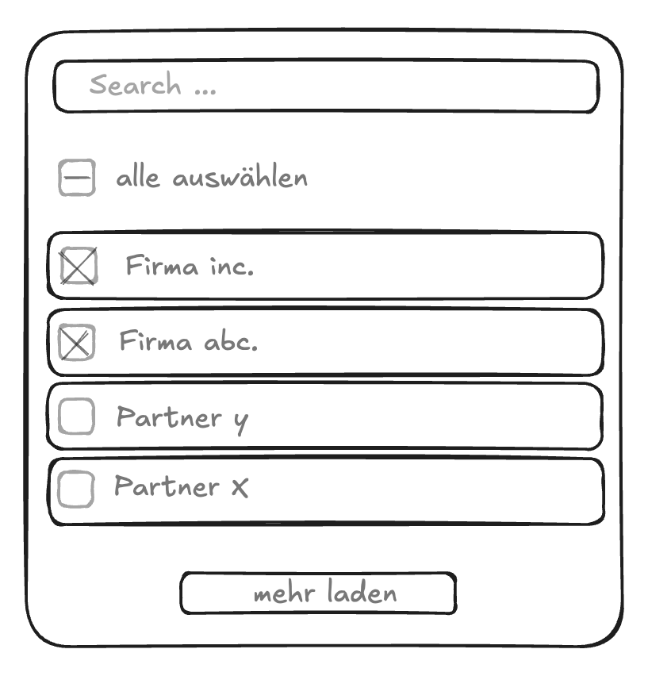

### Frontend-Dev-Test

thanks for taking the time for this test.

Please develop a form to select partners e.g. for exporting data of the selected partner.

You can get the list of partners from the partner-service [searchPartners](./src/app/services/partner/partner.service.ts) fn.
The form should include the following features: 
  * a search functionality. If you select "alle auswählen" all partners that match the search criteria should be selected (not only the visible page). 
  * The "select all" checkbox could have a intermediate checked state, if not all partners are selected.
  * If all partners are selected, the "alle auswählen" checkbox should be checked automatically. 
  * pagination

If you submit the form, the data should be given to the [export service](./src/app/services/export/export.service.ts) createExport fn.
The form could look like this:

The design is not part of this test, only the functionality is relevant. 
You can use any tools and libraries you want. 
